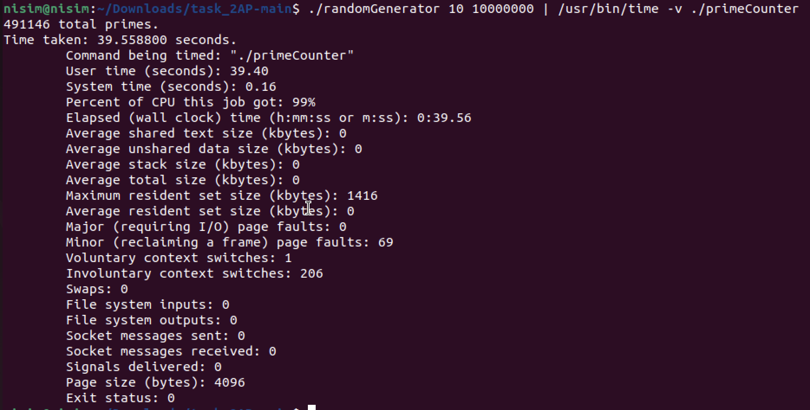

# Prime Counter 
This is an implementation for an assignment in an advanced programming course

## Instructions

1. **Compile the programs**:
    ```sh
    make
    ```

   # useage
   The useage is like this:
   
   ./randomGenerator <seed> <num_of numbers>.
   
   F.ex randomGenerator 10 10 will give you ten numbers, generated with random seed “10”.
   
   ./randomGenerator 10 10000000 | ./newPrimeCounter or ./randomGenerator 10 10000000 | ./PrimeCounter 
   The output will be a single line indicating the total number of primes found in the generated stream of 10,000,000 random numbers, such as "X total primes" where X is the count of
   primes detected.
   
   And another line indicating the time it took.


2. ## Results

    ### Reference Prime Counter
    
    
    
    
    ### Optimized Prime Counter
    
    
    

   ### You can see that in the line "Maximum resident set size (kbytes)" indicates that the peak amount of memory used by the program, in terms of RAM, was  at most 1688 kilobytes (1.688 MB) which is less than 2MB.

5. **Clean up**:
    ```sh
    make clean
    ```

## Explanation

- The `randomGenerator` generates a stream of random numbers.
- The `newPrimeCounter` uses multithreading to count the number of prime numbers in the stream efficiently.
- The `PrimeCounter` count the number of prime numbers in the stream efficiently.
